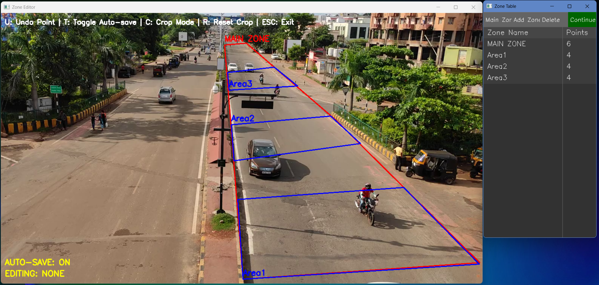
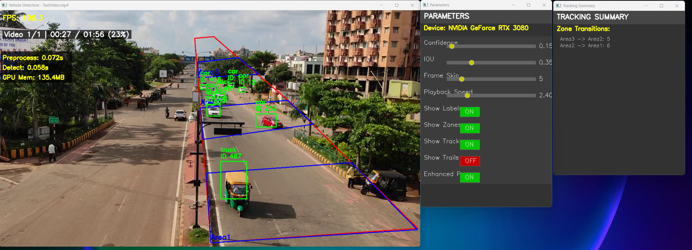

# Vehicle Detection and Tracking System

A computer vision application that detects and tracks vehicles across user-defined zones using YOLO (You Only Look Once) and OpenCV.

## Overview

This system provides real-time vehicle detection and tracking capabilities with zone-based analytics. It's designed for traffic monitoring, parking management, and security surveillance applications.



## Features

- **Real-time Detection**: High-performance vehicle detection using YOLOv8
- **Advanced Tracking**: Multi-object tracking with persistence through occlusions
- **Zone Management**:
  - Interactive zone creation and editing
  - Main detection boundary with sub-zones
  - Vehicle movement analysis between zones
- **Performance Optimization**:
  - GPU acceleration with CUDA support
  - Adjustable frame skip rate
  - Contrast enhancement for low-light conditions
- **Processing Controls**:
  - Real-time parameter adjustment via UI sliders
  - Video progress display with time remaining
  - Checkpoint system for resuming interrupted processing
- **Memory Management**:
  - Automatic and manual trail cleanup
  - Configurable history limits
- **Multi-video Support**:
  - Sequential processing with cross-video continuity
  - Batch processing of multiple video files

## Installation

### Requirements

```bash
pip install -r requirements.txt
```

### Required Files

- One or more video files in the `videos/` directory
- YOLOv8 model (default: "yolov8l.pt" - automatically downloaded if missing)

## Configuration

Key configuration options are located at the top of `vehicle_tracking_system.py`:

```python
# Video settings
VIDEO_PATH = ""              # Single video mode (empty for batch mode)
VIDEOS_DIRECTORY = "videos/" # Directory containing all videos
SUPPORTED_EXTENSIONS = ['.mp4', '.avi', '.mov', '.mkv', '.webm']

# Core settings
MODEL_PATH = "yolov8l.pt"    # YOLOv8 model
ZONES_FILE = "zones.json"    # Zone configuration storage
CHECKPOINT_FILE = "checkpoint.json"  # Checkpoint storage

# Detection parameters
CONF_THRESHOLD = 0.2         # Detection confidence threshold
IOU_THRESHOLD = 0.3          # Non-maximum suppression threshold
FRAME_SKIP = 2               # Process 1 in every N+1 frames
```

## Usage

### Basic Operation

1. **Prepare Videos**:
   - Place video files in the `videos/` directory
   - Videos are processed alphabetically by filename

2. **Run the Application**:
   ```bash
   python vehicle_tracking_system.py
   ```

3. **Resume from Checkpoint**:
   ```bash
   python vehicle_tracking_system.py --resume
   ```

### Zone Configuration

The zone editor opens on first run:

1. Create a main zone (boundary of monitoring area)
2. Add additional zones for tracking vehicle movements
3. Click "Continue" when finished

### Monitoring Interface

The main detection window displays:
- Detected vehicles with bounding boxes
- Zone boundaries
- Parameter controls
- Processing statistics
- Video progress information



## Controls

### Zone Editor

| Action | Control |
|--------|---------|
| Add zone point | Left-click |
| Complete zone | Right-click |
| Undo last point | U |
| Toggle auto-save | T |
| Toggle crop mode | C |
| Reset crop area | R |
| Create main zone | M |
| Add zone | A |
| Delete selected zone | D |
| Save zones | S |
| Scroll zone list | W/Z |
| Exit editor | ESC |

### Detection Window

| Action | Control |
|--------|---------|
| Adjust parameters | Sliders |
| Toggle visualizations | Buttons |
| Save checkpoint | C |
| Exit application | ESC |

## Output

The system generates the following output:

- Individual results files per video in the `results/` directory
- Combined results file at completion (`results/combined_results.json`)
- Checkpoint file for resuming processing (`checkpoint.json`)

Results include:
- Zone transition statistics
- Vehicle path histories
- Timestamp information

## Advanced Features

### Checkpointing System

- Automatic checkpoint after each video
- Periodic checkpoints (default: every 60 seconds)
- Manual checkpoint via 'C' key
- Resume capability with `--resume` flag

### Performance Tuning

- Adjust `FRAME_SKIP` for faster processing (higher values) or better tracking accuracy (lower values)
- Enable/disable GPU acceleration via `USE_GPU` setting
- Modify detection thresholds for different environments

## License

This project is available for personal and commercial use.

## Acknowledgments

- [Ultralytics YOLOv8](https://github.com/ultralytics/ultralytics)
- [OpenCV](https://opencv.org/)
- [PyTorch](https://pytorch.org/)
- [NumPy](https://numpy.org/)
- [Shapely](https://shapely.readthedocs.io/)
